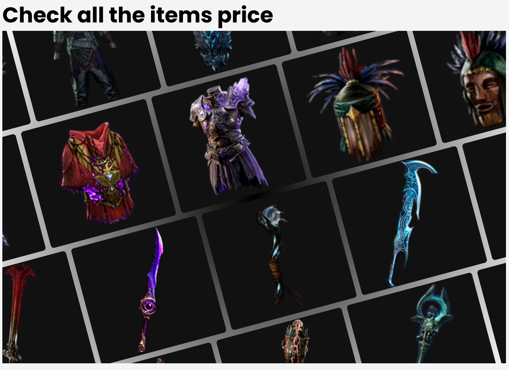
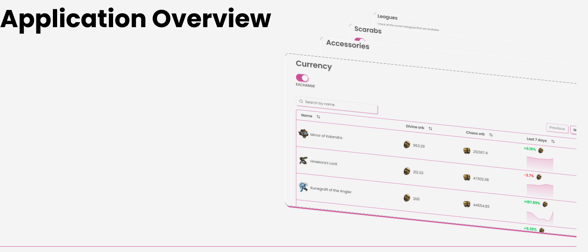
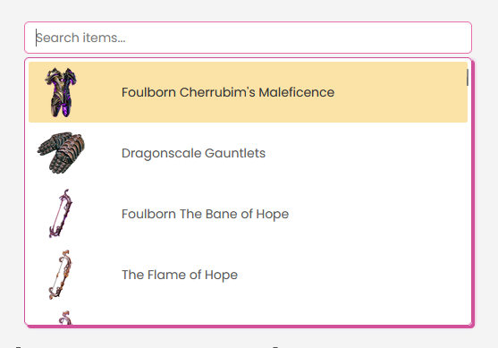
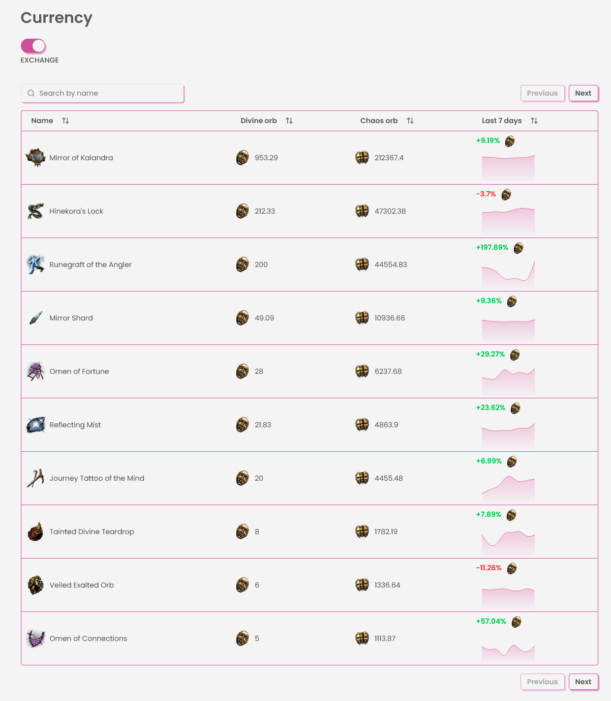
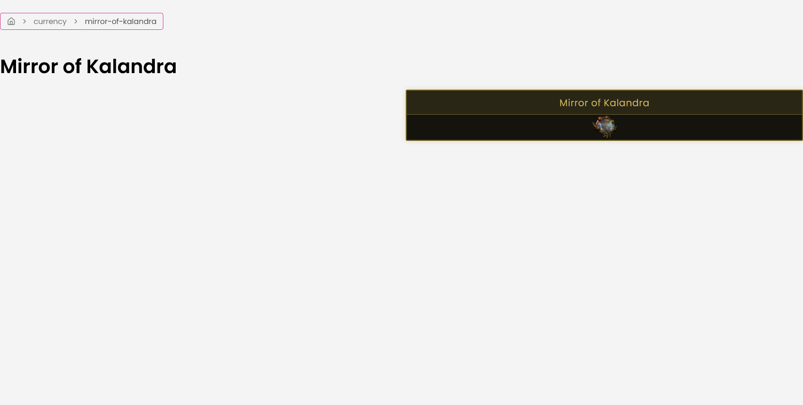

<!-- PROJECT SHIELDS -->
<!--
*** I'm using markdown "reference style" links for readability.
*** Reference links are enclosed in brackets [ ] instead of parentheses ( ).
*** See the bottom of this document for the declaration of the reference variables
*** for contributors-url, forks-url, etc. This is an optional, concise syntax you may use.
*** https://www.markdownguide.org/basic-syntax/#reference-style-links
-->

<!-- PROJECT LOGO -->
 

  

  <h3 align="center">Path of Exile Lab</h3>

  

    An awesome README template to jumpstart your projects!
     
    <a href="https://github.com/LazosPap/path-of-exile-lab"><strong>Explore the docs »</strong></a>
     
     
    <a href="https://poemarket.vercel.app/">View Application</a>
    &middot;
    <a href="https://github.com/LazosPap/path-of-exile-lab/issues/new">Report Bug</a>
    &middot;
    <a href="https://github.com/LazosPap/path-of-exile-lab/issues/new">Request Feature</a>
  

<!-- TABLE OF CONTENTS -->

  
Table of Contents

  <ol>
    <li>
      <a href="#about-the-project">About The Project</a>
      <ul>
        <li><a href="#built-with">Built With</a></li>
      </ul>
    </li>
    <li><a href="#usage">Usage</a></li>
    <li><a href="#license">License</a></li>
    <li><a href="#contact">Contact</a></li>
  </ol>

<!-- ABOUT THE PROJECT -->
## About The Project

Path of Exile Lab is a web application that displays real-time Path of Exile market and laboratory related data using the **poe.watch API**.

The goal of the project is to provide an easy way to explore Path of Exile economy data such as item prices and currencies related information through a clean and interactive interface.

The application fetches data from a third-party API and visualizes it in a simple UI built with React.

It shows for each available league that is currently running the price history of each league.

### Features

- View Path of Exile market data
- Fetch live data from the poe.watch API
- Interactive UI with fast filtering
- Lightweight and responsive design
- Deployed on Vercel

(<a href="#readme-top">back to top</a>)

### API

This project uses the **poe.watch API** as a third-party data source for Path of Exile market information.

### Built With

#### Core Stack

#### Styling & UI

#### Routing & Data Management

#### API Integration

(<a href="#readme-top">back to top</a>)

<!-- USAGE EXAMPLES -->
## Usage

### Landing Section 2

### Application Overview

### Search Results

### Leagues

### Dashboard

### Currency Overview

### Item Overview

(<a href="#readme-top">back to top</a>)

<!-- LICENSE -->
## License

Distributed under the Unlicense License. See `LICENSE.txt` for more information.

(<a href="#readme-top">back to top</a>)

<!-- CONTACT -->
## Contact

Lazaros Papounidis - lazospap3@gmail.com

Project Link: [https://github.com/LazosPap/path-of-exile-lab](https://github.com/LazosPap/path-of-exile-lab)

(<a href="#readme-top">back to top</a>)

<!-- TECHNOLOGY BADGES -->

[React.js]: https://img.shields.io/badge/React-20232A?style=for-the-badge&logo=react&logoColor=61DAFB
[React-url]: https://reactjs.org/

[TypeScript]: https://img.shields.io/badge/TypeScript-007ACC?style=for-the-badge&logo=typescript&logoColor=white
[TypeScript-url]: https://www.typescriptlang.org/

[TailwindCSS]: https://img.shields.io/badge/TailwindCSS-38B2AC?style=for-the-badge&logo=tailwind-css&logoColor=white
[TailwindCSS-url]: https://tailwindcss.com/

[TanStackQuery]: https://img.shields.io/badge/TanStack_Query-FF4154?style=for-the-badge&logo=reactquery&logoColor=white
[TanStackQuery-url]: https://tanstack.com/query/latest

[TanStackRouter]: https://img.shields.io/badge/TanStack_Router-FF4154?style=for-the-badge
[TanStackRouter-url]: https://tanstack.com/router/latest

[Axios]: https://img.shields.io/badge/Axios-5A29E4?style=for-the-badge&logo=axios&logoColor=white
[Axios-url]: https://axios-http.com/

[shadcn]: https://img.shields.io/badge/shadcn/ui-000000?style=for-the-badge
[shadcn-url]: https://ui.shadcn.com/

[Vite]: https://img.shields.io/badge/Vite-646CFF?style=for-the-badge&logo=vite&logoColor=white
[Vite-url]: https://vitejs.dev/
